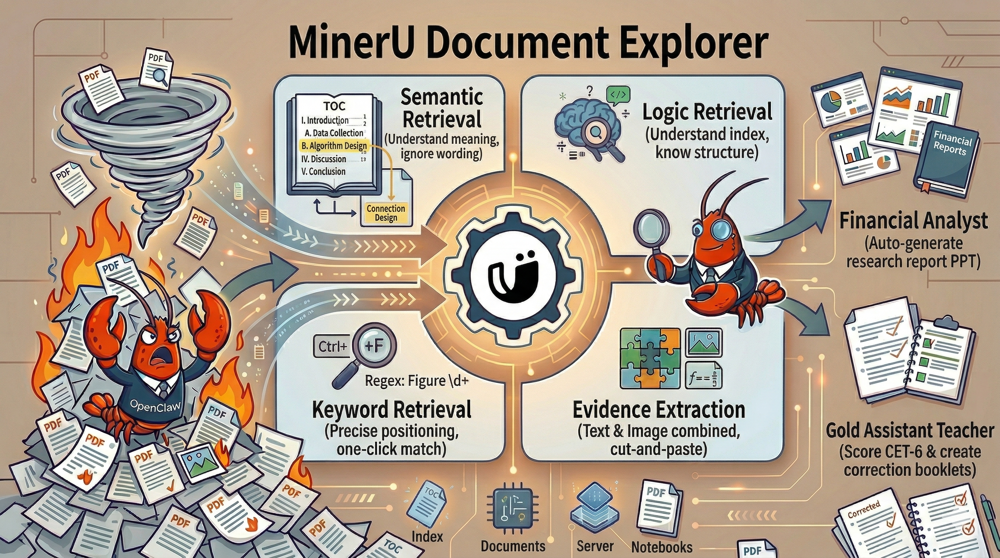

<h1 align="center">
  
  MinerU Document Explorer
</h1>

<p align="center">
  Give your Agent sharp eyes — An Agent-Native Document Reading Skill (Preview Version)
</p>

<p align="center">
  <a href="README_ZH.md">中文</a> · <a href="#">ClawHub</a>
</p>

---

Faced with piles of PDFs, Agents often "brute-force" documents page-by-page to extract data—a process that is inefficient and costly in tokens. **MinerU Document Explorer** solves this by providing Agents with human-like reading skills. Through four modular "atomic" capabilities, it enables flexible extraction and navigation of PDF.

## 🔍 Four Core Capabilities

<p align="center">
  
</p>

| Capability | Description |
|------------|-------------|
| **Logic Retrieval** — understand index, know structure | Navigates the document outline and jumps directly to the target section — no more scrolling from page one |
| **Semantic Retrieval** — understand meaning, ignore exact wording | Natural language queries that find the right page even when you don't know the exact terms; works cross-language |
| **Keyword Retrieval** — precise positioning, one-click match | Regex-powered full-document scan that flags every occurrence of a name, ID, or pattern |
| **Evidence Extraction** — text & image combined, cut and paste | Precisely crops tables, figures, formulas, and other fine-grained elements with element-level citation metadata |

## 📈 Performance Gains

After integrating MinerU Document Explorer, on our benchmark tasks:

- **📉 ~40% fewer tokens** (tested on Claude Opus 4.6): average dropped from 45k to 28k tokens per task
- **🎯 20%+ higher task success rate** (tested on Minimax 2.1): from 60–70% up to ~90%

---

## 🎬 Demo

> Note: The demo video is currently in Chinese. English version coming soon.

https://github.com/user-attachments/assets/21fab48f-f243-4634-9719-76fca518991e

Features demonstrated: Logical Retrieval | Semantic Search | Keyword Search | Evidence Extraction

Real-world use cases:

- 🏦 Act as a "Financial Analyst" — Auto-generate research report PPT
- 📚 Act as a "Teaching Assistant" — Grade CET-6 exams and create error notebooks

---

## 📦 Installation

### Option 1: ClawHub

With only one line of code, you can install our skill.

```
clawhub install mineru-document-explorer
```

After successful execution, Send the following to your OpenClaw agent:
```
Test the downloaded skill called mineru-document-explorer
```

### Option 2: GitHub (let your Agent install it)

Send the following to your OpenClaw agent — it will handle everything automatically:

```
By using `git clone`, install this PDF reading skill for me: https://github.com/opendatalab/MinerU-Document-Explorer, then test it.
```

The agent will: read the install guide → copy the skill directory → run the setup script → guide you through configuration.

After setup, the agent will ask if you want to configure PageIndex (optional — provide an OpenAI-compatible API key to enable auto-generated document outlines; skipping this does not affect any other feature).

---

## 📖 Citation

If this project helps your work, please cite:

```bibtex
@article{wang2026agenticocr,
  title={AgenticOCR: Parsing Only What You Need for Efficient Retrieval-Augmented Generation},
  author={Wang, Zhengren and Ma, Dongsheng and Zhong, Huaping and Li, Jiayu and Zhang, Wentao and Wang, Bin and He, Conghui},
  journal={arXiv preprint arXiv:2602.24134},
  year={2026}
}

@article{niu2025mineru2,
  title={Mineru2.5: A decoupled vision-language model for efficient high-resolution document parsing},
  author={Niu, Junbo and Liu, Zheng and Gu, Zhuangcheng and Wang, Bin and Ouyang, Linke and Zhao, Zhiyuan and Chu, Tao and He, Tianyao and Wu, Fan and Zhang, Qintong and others},
  journal={arXiv preprint arXiv:2509.22186},
  year={2025}
}
```

---

## 🤝 Acknowledgement

Thanks to [MinerU](https://github.com/opendatalab/MinerU) for document parsing capabilities that enable keyword search and pattern matching.

Thanks to [PageIndex](https://github.com/VectifyAI/PageIndex) for powering the logic retrieval feature.

Thanks to [Qwen3-VL-Embedding](https://github.com/QwenLM/Qwen3-VL-Embedding) for powering the semantic retrieval feature.

---

## 📄 License

This project is open-sourced under the [MIT License](LICENSE).
